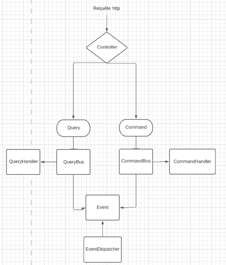

# Architecture logiciel - TradeMe

*Auteurs: Paul Barrié & Thomas Lemaire*

> ## Architecture générale
Cette API basée sur Spring Boot et Java11 propose un système de mise en relation de chefs de projets pour des chantiers de construction
et des artisans.

Le système est bâti selon une architecture CQRS (*Command Query Responsability Segregation*). Cette architecture consiste à
traiter de manière différenciée les commandes (ie: les routes `POST PUT DELETE`) et les requêtes (ie: les routes `GET`).

Lorsqu'une requête est reçue par le contrôlleur, un évènement est alors généré et envoyé dans un bus. Un event handler
est alors chargé de traiter la requête et de renvoyer une réponse, et un event dispatcher est chargé d'appliquer un traitement
aux évènements. Dans notre cas, les event dispatcher n'appliquent pas de traitement particulier, mais affichent un message 
sur la sortie standard.

Source: https://prograide.com/pregunta/48209/comment-afficher-une-image-locale-dans-markdown
> ## Traitement des use cases
>> ### Use case 1: inscription d'un membre
Concernant les membres, nous distinguerons deux types de membres différents: les contractors -qui publient les projets et font
appellent à des services d'artisans- et les tradesmen, qui répondent aux annonces publiées par les contractors.

Pour chaque type de membre, les paramètres suivants seront requis:
* Ceux liés à son identité: `first_name`, `last_name`, `birth`, `email`.
* Ceux liés à son authentification: `username`, `password`.
* Ceux liés à son addresse: `street_number`, `street_name`, `city`, `country`, `zip_code`.

>>> #### Inscription d'un contractor
Pour l'inscription d'un contractor, il faut appeler la route `POST /contractor`.
Par ailleurs, le profil d'un contractor peut être complété d'un ou plusieurs moyen de paiement. Pour cela, il faut appeler la
route `POST /payment/?contractor_id=<id>`, en précisant les paramètres suivant:

* Si le paiement est une carte de crédit: `number`, `owner`, `expiration`, `security_numner`.
* Si le paiement est un RIB: `account_identifier`, `bank_identifier`.

Lorsqu'un paiement est enregistré, un cronjob s'assure de réaliser un paiement régulier (toutes les minutes), en guise d'abonnement
à la plateforme.
>>> #### Inscription d'un tradesman
Pour l'inscription d'un contractor, il faut appeler la route `POST /tradesman/?contractor_id=<id>`.
Par ailleurs, le profil d'un contractor peut être complété:

* De ses diplômes en appelant la route `PUT /tradesman/education` en précisant les paramètres `tradesman_id`, `domain`, `level`
où level peut prendre les valeurs: `BEP`, `BAC`, `BTS` (cf enum `EducationLevel`).
* De son expérience professionnelle en appelant la route `PUT /tradesman/experience` en précisant les paramètres `tradesman_id`, `domain`, `year`.

Les paramètres `domain` correspondent aux domaines d'activité de l'artisan et peuvent prendre les valeurs: 
`ELECTRICITY`, `PLUMBING`, `MASONRY`, `PAINTING`, `HEATING` et `GARDENING` (cf enum `WorkDomain`).

>> ### Use case 2: requête d'un tradesman
Le choix qui a été réalisé pour ce use case est de permettre de trouver un tradesman selon s'il a eu au moins une expérience 
professionnelle ou un diplôme dans l'un des domaines donnés. Pour ce faire, il suffit d'appeler la route 
`GET /tradesmen/search/?domains=<targeted_domain>` qui renverra une liste de tradesmen.

>> ### Use case 3: match d'un tradesman

>> ### Use case 7: création d'un projet
On suppose qu'un projet(`Project`) est une liste de contrats (`Contract`). Un contrat contient une série de renseignements 
spécifiques (compétence, quantité de travail en heure, prix horaire, etc.).

Pour créer ce projet, il faut appeler la route: `POST /project` en précisant en paramètre de la requête,
l'id du contractor (`contractor_id`), la durée du chantier en jours (`day_duration`) ainsi que la localisation du chantier 
(`location`). À la création du projet son statut est `PENDING`.

Le contractor peut par la suite rajouter un contrat au projet précédemment créé en appellant la route: `POST /project/contract`
et en lui précisant l'id du projet concerné(`project_id`), le salaire horaire (`hourly_wage`), le nombre d'heures de travail 
souhaité (`nb_hours`), ainsi que le domaine de compétence recherché (`work_domain`).
Pour activer le projet, il suffit d'appeler la route `PUT /project/activate` en lui précisant l'id du projet concerné (`project_id`). 
Le statut du projet passe alors en `VALIDATED` et les contrats afférents deviennent `PUBLISHED`.

> ## Tests

L'API peut être testée avec l'environnement Postman disponible [ici](https://www.getpostman.com/collections/4789810c624658a4309b).
Des tests ont par ailleurs été ajoutés en utilisant la librairie `spring test` et l'utilitaire `MockMVC`.